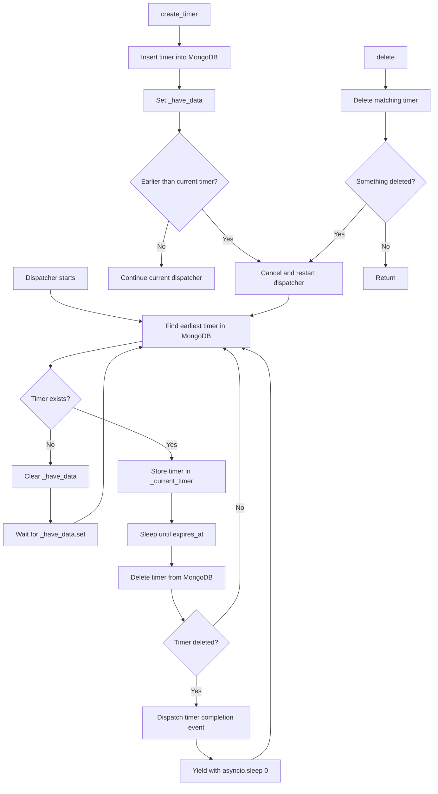
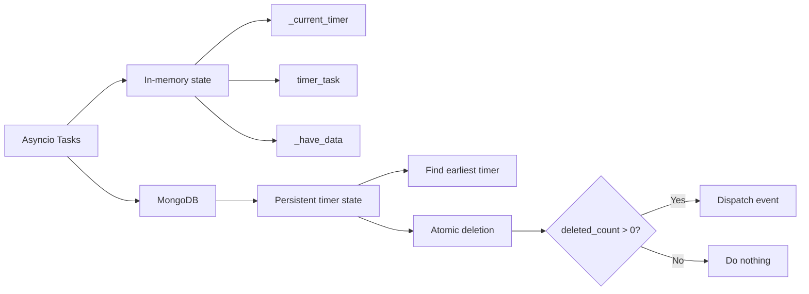
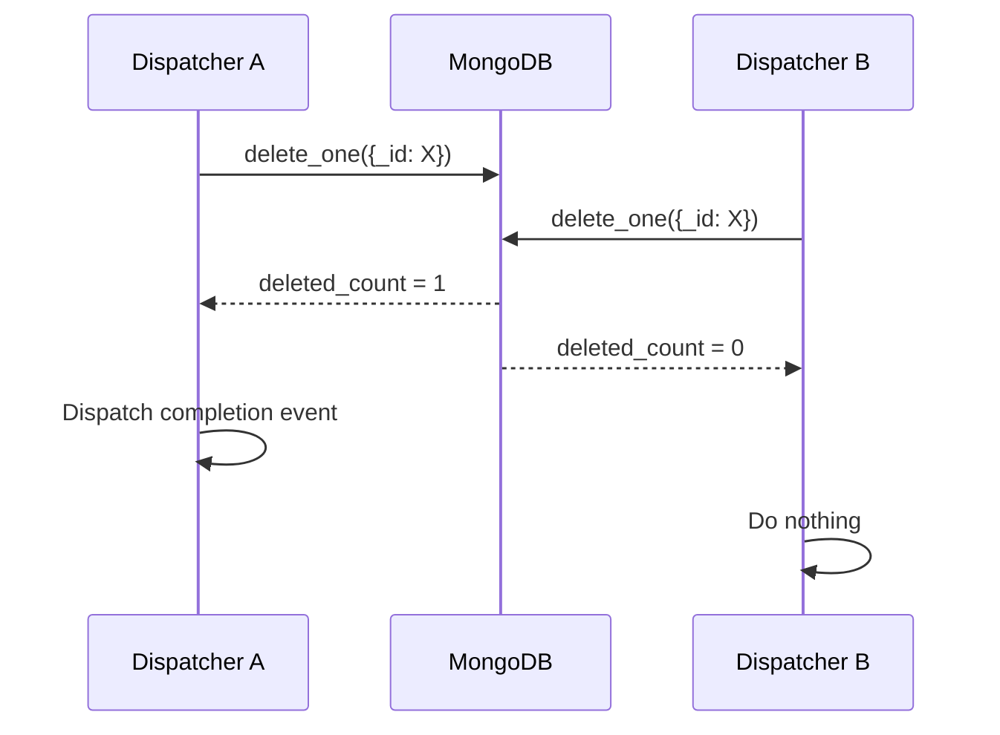
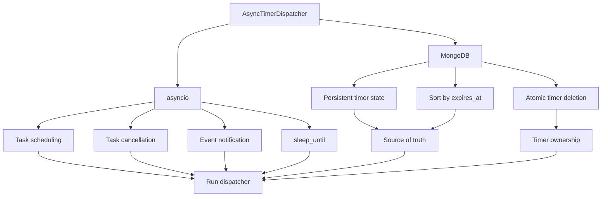
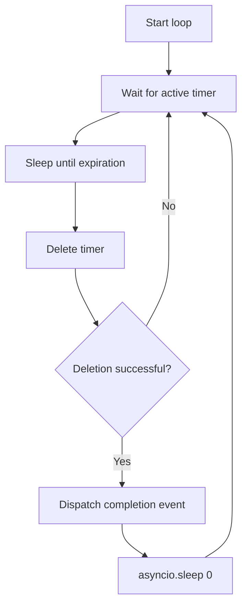
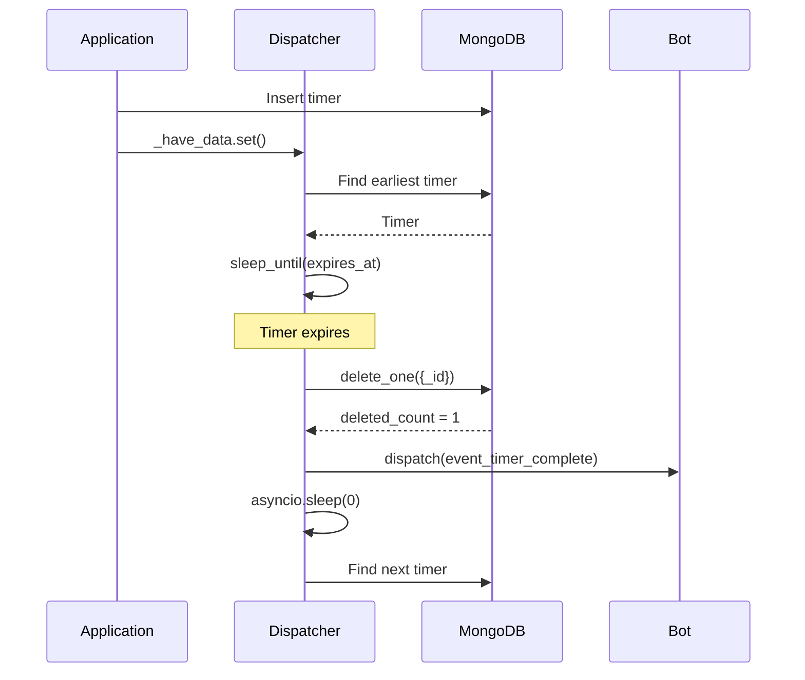
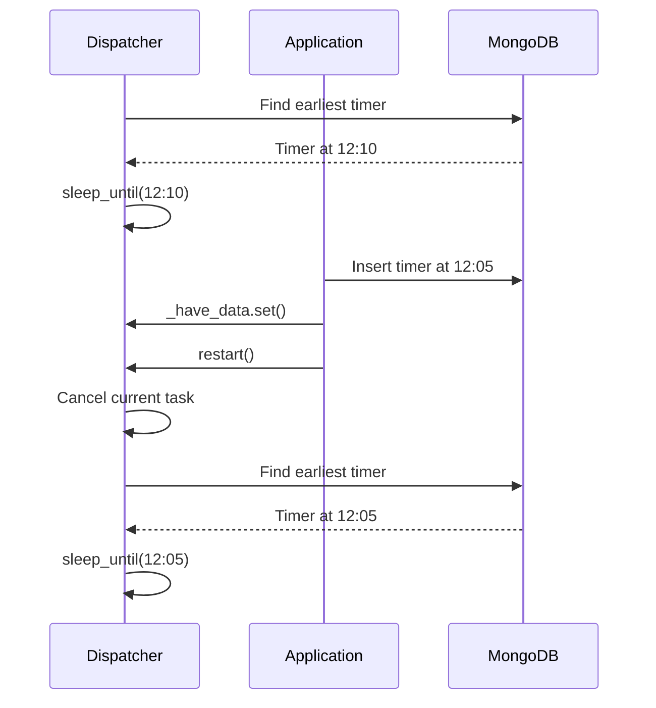

# Async Timer Dispatcher

The `AsyncTimerDispatcher` is a persistent timer scheduler backed by MongoDB and integrated with `asyncio`.

It does **not** continuously poll MongoDB at a fixed interval. Instead, it finds the timer that expires next and sleeps until that timer is due.

The database remains the source of truth, while `asyncio.Event` and `asyncio.Task` are used to coordinate the dispatcher.

## Working principle

The dispatcher follows this general process:

1. Find the earliest timer in MongoDB.
2. If no timer exists, wait for a notification that a timer was created.
3. If a timer exists, wait until its `expires_at` timestamp.
4. Delete the timer from MongoDB.
5. If the deletion succeeded, dispatch its completion event.
6. Yield control back to the event loop.
7. Find the next timer and repeat.

The overall flow looks like this:



## Why it does not poll MongoDB

A simple timer implementation might check the database every second:

```text
query database
    │
    v
sleep 1 second
    │
    v
query database
    │
    v
sleep 1 second
    │
    v
...
```

This dispatcher does not do that.

Instead, suppose the earliest timer expires at `12:30:00`:

```text
query database
    │
    v
timer expires at 12:30:00
    │
    v
sleep until 12:30:00
    │
    v
process timer
```

The dispatcher can therefore remain suspended for the entire duration without repeatedly querying MongoDB.

The waiting operation is:

```python
await discord.utils.sleep_until(data["expires_at"])
```

## Timer data

Timers are stored in MongoDB using the `TimerData` schema.

| Field        | Description                                               |
| ------------ | --------------------------------------------------------- |
| `_id`        | MongoDB's unique identifier for the timer.                |
| `expires_at` | UTC timestamp at which the timer should be dispatched.    |
| `created_at` | UTC timestamp at which the timer was created.             |
| `event_name` | Base name of the event to dispatch.                       |
| `metadata`   | Application-specific data passed to the dispatched event. |

A timer can be represented conceptually as:

```json
{
    "_id": "...",
    "expires_at": "2026-09-21T12:30:00Z",
    "created_at": "2026-09-21T12:00:00Z",
    "event_name": "reminder",
    "metadata": {
        "user_id": 123,
        "channel_id": 456
    }
}
```

## Finding the active timer

The dispatcher always works with the timer that expires first.

It queries MongoDB using:

```python
return await self.timers_collection.find_one({}, sort=[("expires_at", pymongo.ASCENDING)])
```

If MongoDB contains:

```text
Timer A -> 12:30
Timer B -> 12:10
Timer C -> 12:45
```

the dispatcher selects:

```text
Timer B -> 12:10
```

MongoDB remains authoritative. The `_current_timer` attribute is only a scheduling cache.

## Waiting when there are no timers

When the collection is empty, the dispatcher does not repeatedly query MongoDB.

It clears `_have_data` and waits:

```python
self._have_data.clear()
self._current_timer = None

await self._have_data.wait()
```

`asyncio.Event.wait()` suspends the dispatcher coroutine without blocking the event loop.

Other bot tasks continue running normally.

When a timer is created, `create()` calls:

```python
self._have_data.set()
```

This wakes the dispatcher.

The dispatcher then queries MongoDB again to determine which timer should actually be processed.

### `asyncio.Event` is only a notification

The event does not contain the timer.

It only communicates:

> There may be timer data in MongoDB. Check again.

The flow is:

```text
_have_data.set()
      │
      v
wake dispatcher
      │
      v
query MongoDB
      │
      v
find earliest timer
```

This distinction is important because MongoDB remains the source of truth.

### Waiting for a timer

Once the earliest timer has been selected, the dispatcher waits until its expiration:

```python
await discord.utils.sleep_until(data["expires_at"])
```

For example:

```text
Current time:     12:00
Timer expiration: 12:10
```

The dispatcher waits until approximately `12:10` instead of waking every second to check whether the timer has expired.

After the timer expires, it is passed to `call_timer()`.

## Dispatching a timer

The dispatcher first deletes the timer from MongoDB:

```python
deleted = await self.timers_collection.delete_one({"_id": data.get("_id")})
```

The deletion result is checked:

```python
if deleted.deleted_count == 0:
    return
```

Only the coroutine that successfully deletes the timer is allowed to dispatch it.

After successful deletion:

```python
self.bot.dispatch(f"{data['event_name']}_timer_complete".lower(), metadata=data["metadata"])
```

For example:

```text
event_name = "reminder"
```

produces:

```text
on_reminder_timer_complete
```

with the timer's metadata passed to the event.

## Why delete before dispatch?

The timer is deliberately deleted **before** the application event is dispatched.

This means that if the dispatcher subsequently restarts, the same timer is no longer present in MongoDB and cannot be selected again.

The database operation therefore acts as the timer's consumption step:

```text
Timer exists
    │
delete timer
    │
deletion succeeded?
   / \
 no   yes
 │      │
return  dispatch event
```

## Creating timers

Timers are created using `create()`.

A timer document is constructed:

```python
post = {"expires_at": expires_at, "created_at": discord.utils.utcnow(), "event_name": event_name, "metadata": metadata}
```

It is then inserted into MongoDB:

```python
insert_data = await self.timers_collection.insert_one(post)
```

After insertion, the dispatcher is notified:

```python
self._have_data.set()
```

This is necessary when the dispatcher is currently waiting because there are no timers.

### Creating an earlier timer

There is an important special case.

Suppose the dispatcher is currently waiting for:

```text
Current timer -> 12:10
```

and another coroutine creates:

```text
New timer -> 12:05
```

The dispatcher is already sleeping until `12:10`.

It cannot automatically know that a new timer was inserted with an earlier expiration time.

Therefore `create()` checks:

```python
if self._current_timer and self._current_timer["expires_at"] > expires_at:
    self._current_timer = post
    await self.restart()
```

The old dispatcher is cancelled and a new dispatcher is created.

The sequence becomes:

```text
Old dispatcher
     │
     │ sleeping until 12:10
     │
     v
new timer inserted for 12:05
     │
     v
old dispatcher cancelled
     │
     v
new dispatcher starts
     │
     v
query MongoDB
     │
     v
find 12:05 timer
     │
     v
sleep until 12:05
```

This avoids having to modify an already-running sleep operation.

## Deleting timers

Timers can also be explicitly deleted with `delete()`.

The method constructs a MongoDB filter from the event name and metadata:

```python
filters = {"event_name": event_name, **{f"metadata.{k}": v for k, v in metadata_filter.items()}}
```

It can delete either one matching timer:

```python
await self.timers_collection.delete_one(filters)
```

or multiple matching timers:

```python
await self.timers_collection.delete_many(filters)
```

If nothing was deleted, the dispatcher does not need to change:

```python
if data.deleted_count == 0:
    return
```

If one or more timers were deleted, the dispatcher is restarted:

```python
await self.restart()
```

This is necessary because the deleted timer may have been the timer currently being awaited.

## Restarting the dispatcher

`restart()` discards the current scheduling state and creates a new dispatcher task:

```python
self._current_timer = None

if self.timer_task is not None:
    self.timer_task.cancel()
    self.timer_task = self.bot.loop.create_task(self.dispatch_timers())
```

The important property is that the new dispatcher does not trust the old cached state.

Instead, it goes back to MongoDB:

```text
restart
   ↓
discard _current_timer
   ↓
start dispatcher task
   ↓
query MongoDB
   ↓
find current earliest timer
```

This makes changes to the database safe even when the in-memory scheduling state has become stale.

## Why there is no `asyncio.Lock()`

The dispatcher intentionally does not use an `asyncio.Lock()`.

This works because synchronization is divided between `asyncio` and MongoDB.



There are several reasons a lock is unnecessary.

### 1. Asyncio uses cooperative scheduling

An asyncio task is not arbitrarily interrupted in the middle of ordinary Python execution.

For example:

```python
self._current_timer = post
```

cannot be interrupted halfway through that assignment by another asyncio task.

The meaningful concurrency boundaries are operations that suspend the coroutine, such as:

```python
await self.timers_collection.find_one(...)
await discord.utils.sleep_until(...)
await self.timers_collection.delete_one(...)
```

At those points, another asyncio task can run.

This does mean asyncio programs can have race conditions. It simply means that a lock is not automatically necessary whenever multiple tasks access the same object.

### 2. MongoDB handles timer consumption atomically

The most important operation is:

```python
deleted = await self.timers_collection.delete_one({"_id": data.get("_id")})
```

followed by:

```python
if deleted.deleted_count == 0:
    return
```

Imagine two dispatcher instances somehow attempt to process the same timer:



Only one deletion can succeed for the same document.

The dispatcher that receives:

```text
deleted_count = 1
```

owns the timer and dispatches the event.

The dispatcher that receives:

```text
deleted_count = 0
```

does nothing.

This is effectively a compare-and-consume operation performed by MongoDB instead of an application-level lock.

### 3. `_have_data` is not protecting shared state

`_have_data` is an `asyncio.Event`, not a lock.

It does not protect the timer collection or `_current_timer`.

It simply signals:

```text
"MongoDB may now contain a timer."
```

Multiple calls to:

```python
self._have_data.set()
```

are harmless.

The event itself does not contain the timer, so there is no timer data that can be lost.

After waking, the dispatcher queries MongoDB again.

```text
             _have_data.set()
                    │
                    v
             Wake dispatcher
                    │
                    v
             Query MongoDB
                    │
                    v
          Authoritative timer state
```

### 4. `_current_timer` is allowed to become stale

`_current_timer` is not the authoritative timer state.

It is only a scheduling cache.

If another coroutine changes MongoDB and the cached timer is no longer correct, the dispatcher can simply discard the cache:

```python
self._current_timer = None
```

and restart.

The new dispatcher queries MongoDB and reconstructs its state.

This gives the implementation a useful property:

> **Stale in-memory scheduling state is safe because it can always be discarded and rebuilt from MongoDB.**

There is therefore no requirement to keep `_current_timer` perfectly synchronized at all times.

### 5. Cancellation replaces complicated scheduler locking

Suppose the dispatcher is waiting for:

```text
12:10
```

and a new timer is created for:

```text
12:05
```

Rather than attempting to modify the existing sleep operation, the implementation cancels the old dispatcher and creates a new one.

```text
                    ┌─────────────────────┐
                    │ Dispatcher sleeping │
                    │     until 12:10     │
                    └──────────┬──────────┘
                               │
                       new timer: 12:05
                               │
                               v
                         cancel task
                               │
                               v
                    ┌─────────────────────┐
                    │ New dispatcher task │
                    └──────────┬──────────┘
                               │
                               v
                        query MongoDB
                               │
                               v
                         select 12:05
```

This is considerably simpler than maintaining a lock around a mutable scheduler and trying to modify its current deadline.

## Synchronization model

The dispatcher can therefore be viewed as two cooperating systems.



The responsibilities are:

| Component         | Responsibility                                   |
| ----------------- | ------------------------------------------------ |
| `asyncio.Task`    | Runs the long-lived dispatcher.                  |
| `asyncio.Event`   | Wakes the dispatcher when timer data may exist.  |
| `sleep_until()`   | Suspends execution until a timer expires.        |
| `_current_timer`  | Caches the timer currently being scheduled.      |
| `timer_task`      | Holds the active dispatcher task.                |
| MongoDB           | Stores authoritative persistent timer state.     |
| MongoDB deletion  | Atomically consumes a timer.                     |
| `restart()` | Discards stale scheduling state and rebuilds it. |

The absence of a lock is therefore intentional.

The dispatcher relies on:

1. Cooperative asyncio task execution.
2. `asyncio.Event` for notification.
3. Task cancellation and recreation when scheduling state changes.
4. MongoDB as the authoritative source of timer state.
5. MongoDB's atomic deletion to determine which consumer owns an expired timer.

### Main dispatcher loop

The long-running dispatcher is implemented conceptually as:

```python
while not self.bot.is_closed():
    timer = self._current_timer = await self.wait_for_active_timer()

    if timer is None:
        raise RuntimeError(...)

    await self.__dispatch_timer(**timer)

    await asyncio.sleep(0)
```

The `asyncio.sleep(0)` at the end is intentional.

It yields control back to the event loop before the dispatcher immediately checks for another timer.

This prevents a sequence of immediately-expired timers from monopolizing the event loop.

The loop is therefore:



### Connection failures and cancellation

The dispatcher treats network/database connection failures as recoverable:

```python
except OSError, discord.ConnectionClosed, ConnectionFailure:
    await self.restart()
```

The dispatcher is therefore recreated after a connection failure.

`asyncio.CancelledError` is handled separately:

```python
except asyncio.CancelledError:
    raise
```

Cancellation is part of the dispatcher's normal control flow.

It is used when the current scheduling state needs to be discarded, such as when an earlier timer is inserted.

Cancellation should therefore not be treated as a connection failure.

### Searching timers

`search()` returns all timers matching an event name and metadata filter:

```python
filters = {"event_name": event_name, **{f"metadata.{k}": v for k, v in metadata_filter.items()}}

cursor = self.timers_collection.find(filters, sort=[("expires_at", pymongo.ASCENDING)])

return await cursor.to_list(length=None)
```

Results are ordered by `expires_at`, so the returned list is ordered from earliest to latest timer.

### Getting a specific timer

`get()` performs a normal MongoDB equality query:

```python
return await self.timers_collection.find_one(filters)
```

It returns the first matching timer or `None` if no timer matches.

### `__dispatch_timer()`

`__dispatch_timer()` handles the waiting and dispatching of a single timer:

```python
await discord.utils.sleep_until(data["expires_at"])
await self.call_timer(**data)
```

It is separated from the main dispatcher loop so that the actual per-timer waiting and consumption logic remains independent from the logic that repeatedly selects the next timer.

## Complete lifecycle

Putting everything together:



If a new earlier timer is inserted while the dispatcher is sleeping:



## Summary

The key design principle is:

> **MongoDB stores the state; asyncio handles the waiting and scheduling.**

The dispatcher does not poll MongoDB continuously.

Instead:

```text
Find earliest timer
       ↓
Sleep until expiration
       ↓
Atomically delete timer
       ↓
Dispatch completion event
       ↓
Find next timer
```

When no timers exist:

```text
No timer
   │
   v
Clear Event
   │
   v
Wait
   │
   v
Timer created
   │
   v
Set Event
   │
   v
Query MongoDB again
```

When the timer collection changes in a way that invalidates the current scheduling state:

```text
Database changed
      │
      v
Discard cached state
      │
      v
Cancel dispatcher
      │
      v
Create new dispatcher
      │
      v
Read authoritative state from MongoDB
```

The design does not require `asyncio.Lock()` because it does not depend on perfectly synchronized in-memory state.

Instead:

* `asyncio` provides cooperative task scheduling.
* `asyncio.Event` provides notifications.
* Task cancellation invalidates stale scheduling state.
* MongoDB remains the source of truth.
* MongoDB's atomic deletion determines which consumer successfully owns an expired timer.

This keeps the dispatcher relatively simple while allowing the timer state to remain persistent and recoverable.
