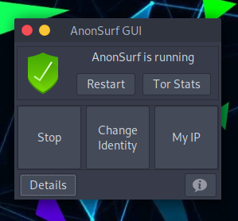
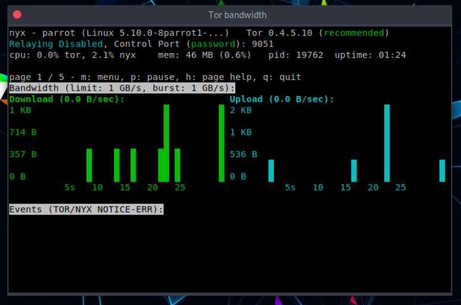
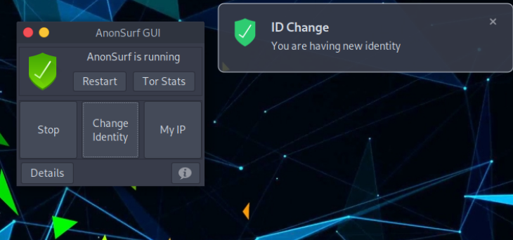
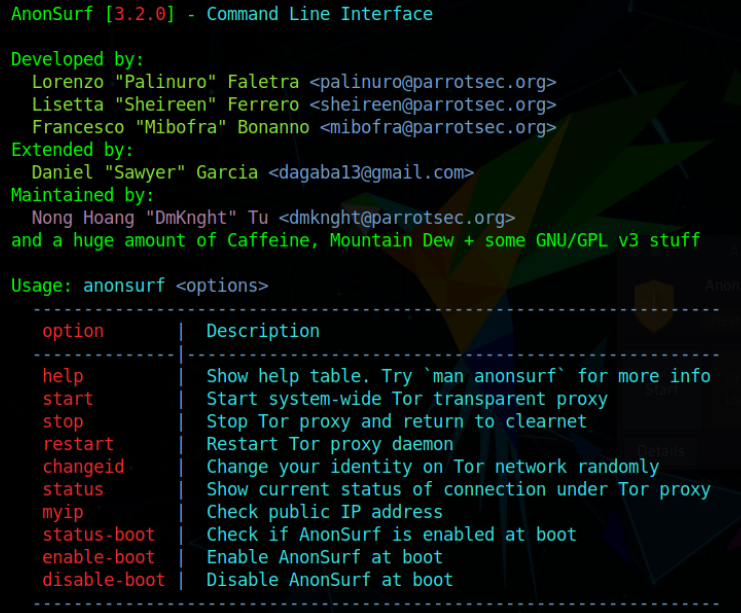
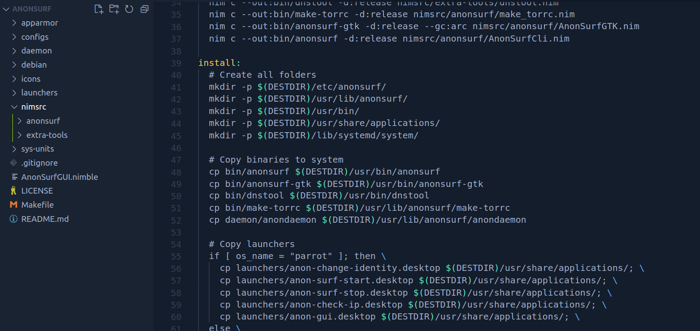

# What is AnonSurf? #

[AnonSurf](https://nest.parrotsec.org/packages/tools/anonsurf/-/tree/3.2.0) is Parrot's anonymous mode wrapper to force connections through [Tor](https://www.torproject.org/). It is written in Nim Language and uses GTK libraries so it can be used via a graphical interface (GUI) and a CommandLine Interface (CLI).

It can be used on ParrotOS and it is pre-installed on both main editions (Home and Security). It can be started from the Parrot menu, going to **Applications** and then **Privacy**:

 

To start it, press **Start**, and to verify that everything is working, you can click on **My IP** and **Details**.

Clicking on **Tor Stats** will show all the details about the current use being made under the Tor network.

With **Change Identity** you will switch to another exit node:

### AnonSurf CLI ###

## Technical details ##

AnonSurf works on *iptables* forcing applications to use the Tor network. **iptables** is an integrated firewall in the Linux kernel that allows the incoming and outgoing passage of all packages, then Tor is used to perform the tunneling of all the user's traffic in an anonymous way.

Since version 3.2.0, AnonSurf has been rewritten, with a new code structure. The new versions are available [here](https://nest.parrotsec.org/packages/tools/anonsurf) and you can try them by following this guide:

First of all, being written in Nim, some dependencies need to be installed:

    sudo apt install nim

\

    nimble install gintro

Then you can download the anonsurf source:

    cd anonsurf/

\

    make build-parrot

\
    
    make install

## Some information about Tor ##

- Tor is a SOCKS4/SOCKS5 encryption protocol.
- Tor tunnels all traffic running across the users network anonymously.
- Tor conceals a user's location and network data from anyone monitoring the user locally, and remotely.

### Tor Has Several Use Cases ###

- Used with on the browser (torbrowser) 
- IRC clients (like hexchat)
- Instant messanging (torchat, tormessanger)
- Hidden servers (Creating .onion sites)

### Tor Technical Details ###

- The Tor protocol works by multiplexing [1] multiple “circuits” over a single node-to-node TLS connection.
- Tor traffic is routed through 3 nodes by default: Guard, relay, and exit.

[1] To be able to route multiple relays, Tor has something called *stream multiplexing capability*: 
- multiple TCP connections can be carried over a single Tor circuit. 
- Each node knows only the source and destination pairing for a circuit. It does not know the whole path.
     
