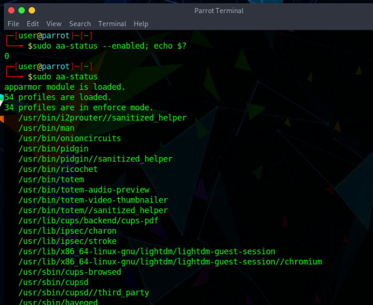

# AppArmor #

AppArmor is an effective and easy-to-use Linux application security system. AppArmor proactively protects the operating system and applications from external or internal threats, even zero-day attacks, by enforcing good behavior and preventing even unknown application flaws from being exploited. 

AppArmor security policies completely define what system resources individual applications can access, and with what privileges. Several default policies are included with AppArmor, and using a combination of advanced static analysis and learning-based tools, AppArmor policies for even very complex applications can be deployed successfully in a matter of hours.

## Check if AppArmor is installed ##

AppArmor and it's profiles should already be enabled and running on Parrot OS. To check if AppArmor is active do:

    sudo aa-status --enabled; echo $?

The output should return 0. Alternatively run the following command to see the loaded AppArmor profiles:

    sudo aa-status

If for any reason AppArmor is not pre-installed, continue reading below.

## Install AppArmor ##

    sudo apt install apparmor apparmor-utils auditd

**apparmor** = main package \
**apparmor-utils** = utilities for controlling apparmor profiles \
**auditd** = automatic profile generation tools 

\

To enable AppArmor run the followng commands:

    sudo mkdir -p /etc/default/grub.d

\

    echo 'GRUB_CMDLINE_LINUX_DEFAULT="$GRUB_CMDLINE_LINUX_DEFAULT apparmor=1 security=apparmor"' | sudo tee /etc/default/grub.d/apparmor.cfg

\

    sudo update-grub

\

    sudo reboot

Then run the following command to inspect the current state:

    sudo aa-status

This will list all loaded AppArmor profiles for applications, processes and detail their status (enforced, complain, unconfined). 

For example, to check what is enforce mode, run the following command:

    ps auxZ | grep -v '^unconfined'

To install profile, run the following command:

    sudo apt install apparmor-profiles apparmor-profiles-extra

AppArmor profiles live in `/etc/apparmor.d/`. You can use apparmor_parser(8) to insert them into the kernel. This is done automatically when installing packages that drop policy in `/etc/apparmor.d/`.

For example, to set all "extra" profiles (provided in the apparmor-profiles package) to complain mode (except deny rules that are silently enforced, security policy is not enforced and access violations are logged), do the following:

    cd /usr/share/doc/apparmor-profiles/extras

\

    cp -i *.* /etc/apparmor.d/

\

    for f in *.*; 
        do aa-complain /etc/apparmor.d/$f; 
    done

To set these profiles to **enforce mode**, use `aa-enforce` instead of `aa-complain`. Beware though: many of these profiles are not up-to-date and will break functionality in enforce mode (and possibly even in complain mode); enforce them only if you're ready to improve them upstream. 

## Disable AppArmor ##

First, you can disable individual profiles with `aa-disable`.
But if you want to *entirely* disable AppArmor on your system, run:

    sudo mkdir -p /etc/default/grub.d

\

    echo 'GRUB_CMDLINE_LINUX_DEFAULT="$GRUB_CMDLINE_LINUX_DEFAULT apparmor=0"' | sudo tee /etc/default/grub.d/apparmor.cfg

\

    sudo update-grub

\

    sudo reboot

## Debug AppArmor ##

The `aa-notify` command, from the *apparmor-notify* package, is able to provide a desktop notification whenever a program causes a DENIED message in `/var/log/kern.log`. Grant yourself read permissions for `/var/log/kern.log` by joining the adm group:

    sudo adduser "$USER" adm 

Then `aa-notify` should automatically start the next time you login (using `/etc/xdg/autostart/apparmor-notify.desktop`). If it doesn't, start it manually:

    aa-notify -p 

If you use **auditd**, you should start `aa-notify` in this way:

    sudo aa-notify -p -f /var/log/audit/audit.log

\

#### Diagnose if a bug might have been caused by AppArmor ####

The apparmor-utils package provides many useful commands to debug AppArmor. Find out if AppArmor is enabled through `cat` command:

    cat /sys/module/apparmor/parameters/enabled 

This will return Y if true.

#### Find out which profiles are enabled #####

    sudo aa-status

The command above will list all loaded AppArmor profiles for applications and processes and detail their status (enforced, complain, unconfined).
And, 

    ps auxZ | grep -v '^unconfined'

will list running executables which are currently confined by an AppArmor profile. Sometimes, it's useful to disable a profile and to test again if the bug persists:

    sudo aa-disable /etc/apparmor.d/$profile  

e.g. `sudo aa-disable /etc/apparmor.d/usr.bin.pidgin`. 

You can re-enable the profile in this way: 

    sudo aa-enforce /etc/apparmor.d/$profile

#### Verify the logs ####

    sudo tail -f /var/log/syslog | grep 'DENIED'  

or (if **auditd** is installed): 

    sudo tail -f /var/log/auditd/auditd.log | grep 'DENIED' 

The "DENIED" lines should provide more information on what concrete process or access to the file system has been denied. Output a list of processes with tcp or udp ports that do not have AppArmor profiles loaded:

    sudo aa-unconfined 

also possible with the `--paranoid` parameter.

Profiles in complain mode will send ALLOWED lines in the logs for entries that would normally be DENIED in enforce mode. You can use this to tweak configurations before turning them on in enforce mode.  
