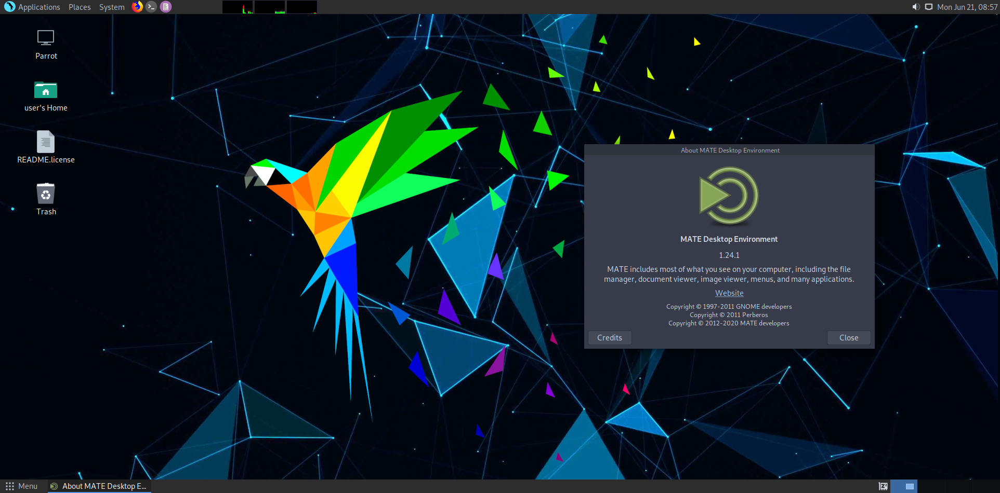
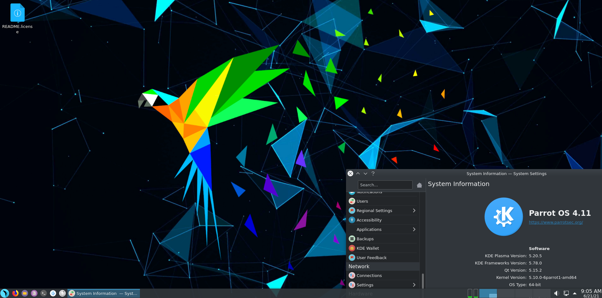

# Desktop Enviroments #

Parrot OS, in addition to being available in the Security and Home editions, also uses various **Desktop Enviroments (DE)**. Each DE has its  peculiarity, but we recommend trying them out before deciding what to install (however, keep in mind that you can install multiple DEs on one OS). 

Being a graphical interface through which the user can interact with the operating system, the possibilities to modify the various components of the DE are many. Each of the following DE gives the possibility to be customized according to one's tastes.

The difference between the three officially supported DE mainly concerns graphic aspects.

Feel free to [download](https://parrotsec.org/download/) the edition that is useful to you and with the DE that you like the most! 

  

    <i class="fa fa-info-circle badge" aria-hidden="true"></i>

**Note**

  

  

  It may be useful to know that the user can install more DE on their Parrot, just type in a terminal:
        
      sudo apt update && sudo apt install parrot-<desktop environment>

  then restart your computer. 
  In the login session you can change DE by clicking on the white dot ⚪️ (it's the "default session") and change DE. You can now use the newly installed DE with all the tools and configurations already present previously.
  

## MATE Desktop ##

[Download Home Edition](https://parrotsec.org/home-edition/)
\
[Download Security Edition](https://parrotsec.org/security-edition/)

If you have another DE, you can install MATE by:
\
`sudo apt install parrot-mate`

## KDE Desktop ##

[Download Home Edition](hhttps://parrotsec.org/home-edition/)
\
[Download Security Edition](https://parrotsec.org/security-edition/)

If you have another DE, you can install KDE by:
\
`sudo apt install parrot-kde`

## XFCE Desktop ##

[Download Home Edition](https://parrotsec.org/home-edition/)

If you have another DE, you can install XFCE by:
\
`sudo apt install parrot-xfce`

