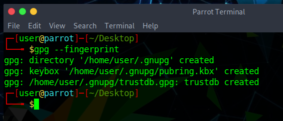
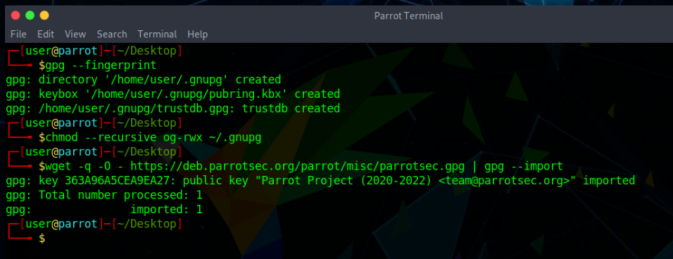
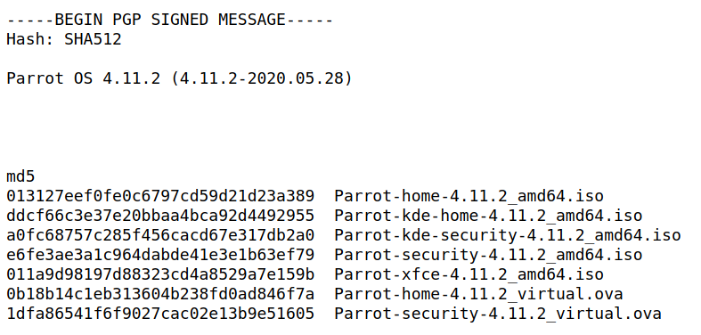
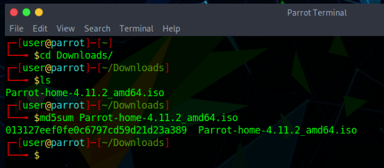
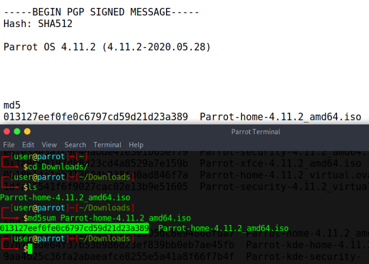
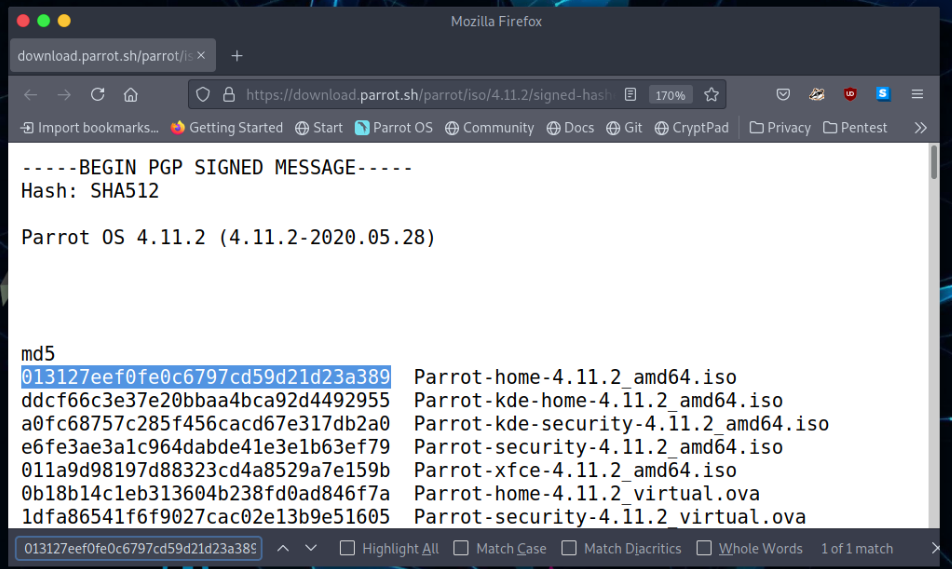
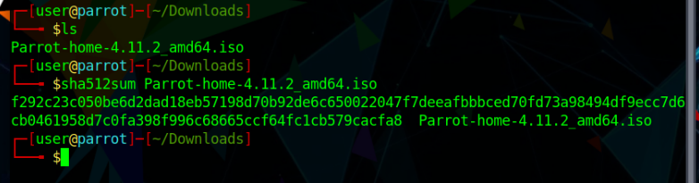

# Hash and key verification #

## Why should anyone verify keys and signatures? ##

Most people — even programmers — are confused about the basic concepts underlying digital signatures. Therefore, most people should read this section, even if it looks trivial at first sight.

Digital signatures can both prove authenticity and integrity to a reasonable degree of certainty. Authenticity ensures that a given file was indeed created by the person who signed it (i.e. that it was not forged by a third party). Integrity ensures that the contents of the file have not been tampered with (i.e. that a third party has not undetectably altered its contents en route).

Digital signatures cannot prove any other property (e.g. that the signed file is not malicious). There is nothing that could stop someone from signing a malicious program (and it happens from time to time in reality).

The point is that we must decide who we will trust (e.g. Linus Torvalds, Microsoft, or the Parrot Project) and assume that if a given file was signed by a trusted party, then it should not be malicious or negligently buggy. The decision of whether to trust any given party is beyond the scope of digital signatures. It’s more of a sociological and political decision.

Once we decide to trust certain parties, digital signatures are useful, because they make it possible for us to limit our trust only to those few parties we choose and not to worry about all the bad things that can happen between us and them, e.g. server compromises ([parrotsec.org](https://parrotsec.org) will surely be compromised one day, so don’t blindly trust the live version of this site), dishonest IT staff at the hosting company, dishonest staff at the ISPs, Wi-Fi attacks, etc.

By verifying all the files we download that purport to be authored by a party we’ve chosen to trust, we eliminate concerns about the bad things discussed above, since we can easily detect whether any files have been tampered with (and subsequently choose to refrain from executing, installing, or opening them).

However, for digital signatures to make any sense, we must ensure that the public keys we use for signature verification are indeed the original ones. Anybody can generate a GPG key pair that purports to belong to the “Parrot OS” but of course only the key pair that we (i.e. the Parrot Team) generated is the *legitimate one*. The next section explains how to verify the validity of the ParrotOS signing keys in the process of verifying a Parrot OS ISO. However, the same general principles apply to all cases in which you may wish to verify a PGP signature, such as verifying repositories, not just ISOs.

## Fetch the key and Verify the repositories ##

Optional: Complete the steps below if unfamiliar with GnuPG or if they haven't already been performed. This will fix eventual *GPG: WARNING: unsafe ownership warnings*.

#### 1. Firstly, make sure that you have GnuPG initialize your user data folder ####

#### 2. Set warning free permissions ####

    chmod --recursive og-rwx ~/.gnupg

#### 3. Get the ParrotOS key ####

    wget -q -O - https://deb.parrotsec.org/parrot/misc/parrotsec.gpg | gpg --import

**Warning**: Checking the GPG signature timestamp makes sense. For example, if you previously saw a signature from 2018 and now see a signature from 2017, then this might be a targeted rollback (downgrade) or indefinite freeze attack. 

## ISO Verification ## 

### md5sum hash verification ###

After you obtained the ISO of your choice go [here: https://download.parrot.sh/parrot/iso/4.11.2/signed-hashes.txt](https://download.parrot.sh/parrot/iso/4.11.2/signed-hashes.txt) to see the signed hashes.

On the first section where it says "MD5" find the hash that matches your downloaded ISO.

For the purpose of this tutorial we will use **Parrot-home-4.11.2_amd64.iso**.

Now open a terminal window and run the following command:

    md5sum Parrot-home-4.11.2_amd64.iso

Compare the **hash (the alphanumeric string on left)** that your machine calculated with the corresponding hash on the page signed-hashes.txt linked above.

An easy way to do this is to open the page "signed-hashes.txt" in your browser, then copy the hash your machine calculated from the terminal into the "Find" box in your browser (in Firefox you can open the "Find" box by pressing CTRL + F).

When both hashes match exactly then the downloaded file is almost certainly intact. If the hashes do not match, then there was a problem with either the download or a problem with the server. You should download the file again from either the same mirror, or from a different mirror if you suspect a server error. If you continuously receive an erroneous file from a server, please be kind and notify the parrot team of that mirror so we can investigate the issue. 

### Other hashes ###

The method for other hashes such as SHA256 or SHA512 is exactly the same with the above guides only instead of md5 you must use the proper hash you want. Let's make an example:

    sha512sum Parrot-home-4.11.2_amd64.iso

