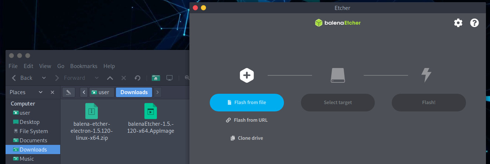
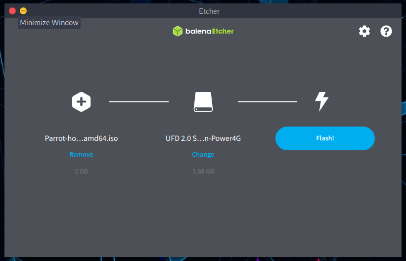
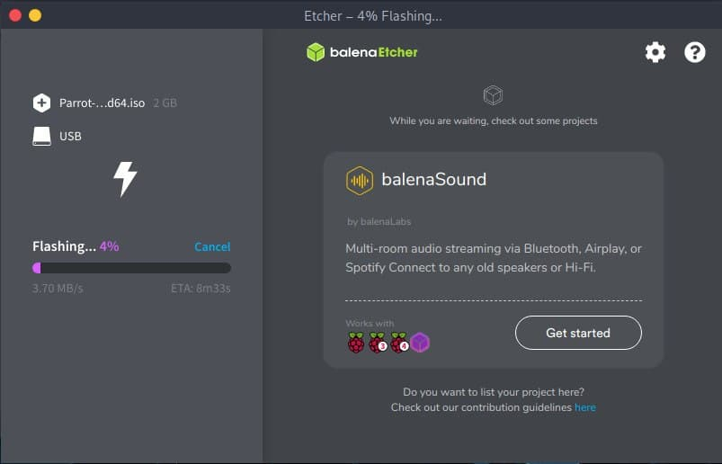
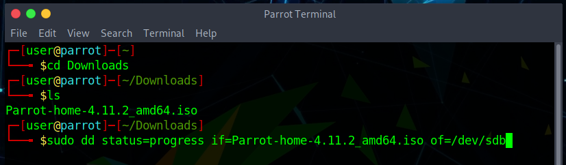
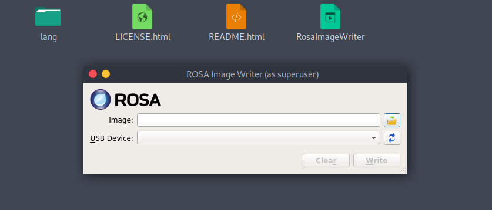
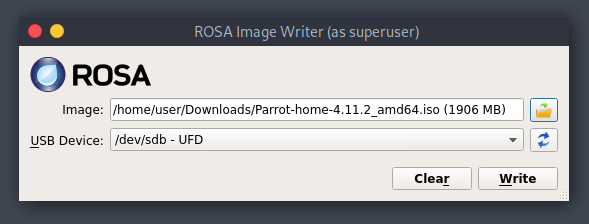

# How to create a Parrot USB drive #

## How to create a Bootable Device ##

First of all, you need to download the latest ISO file from our [website](https://parrotsec.org/download/).

Then you can burn it using [Balena Etcher](https://www.balena.io/etcher/) or [ROSA ImageWriter](http://wiki.rosalab.ru/en/index.php/ROSA_ImageWriter). They both work on GNU/Linux, Mac OS and Windows. We strongly recommend to use Etcher, but you can also use the **DD command line tool** if you prefer it.

The Parrot ISO uses the iso9660 format (also known as isohybrid). It is a special ISO format that contains not only the partition content, but also the partition table.

Some ISO writing programs do not write the iso bit-per-bit into the usb drive at a low level. They create a custom partition table and just copy the file in the USB drive in an unofficial and non-standard way. This behavior is against what the isohybrid was created for, and may break core system functionalities and make the system uninstallable from such USB drives.

It is **highly recommended NOT** to use programs like *unetbootin*, or any program which not isohybrid compliant.

You need a USB drive of at least 8 GB for Security Edition and 4 GB for Home Edition.

A quick summary of which tools you can use to create your Parrot USB:

- [Balena Etcher](<../en/how-to-create-a-parrot-usb-drive.html#parrot-usb-boot-procedure-using-balena-etcher>)
- [DD command line tool](<../en/how-to-create-a-parrot-usb-drive.html#parrot-usb-boot-procedure-using-dd-command-line-tool>)
- [ROSA image writer](<../en/how-to-create-a-parrot-usb-drive.html#parrot-usb-boot-procedure-using-rosa-image-writer>)

## Parrot USB boot procedure using Balena Etcher ##

Plug your USB stick into your USB port and launch **Balena Etcher**. Download and unzip it.
\
Click on *.AppImage file*.

Click on **Flash from file**. Select the Parrot ISO and verify that the USB drive you are going to overwrite is the right one.

**Flash!**

Once the burning is complete, you can use the USB stick as the boot device for your computer and boot Parrot OS.

\

## Parrot USB boot procedure using DD command line tool ## 

**dd** (and its derivatives) is a command line tool integrated in every UNIX and UNIX-like system, and it can be used to write the ISO file into a block device bit per bit. Due to the potential to brick your system, if you are not familiar with GNU/Linux we strongly recommend to use Etcher.

i.g.

    sudo dd status=progress if=Parrot-<edition>-<version>_amd64.iso of=/dev/sdX

## Parrot USB boot procedure using ROSA image writer ## 

As mentioned at the beginning of this chapter, you can also use ROSA image writer to create your USB with Parrot. Download it from the website and extract all files. Then, click on "*RosaImageWriter*":

Select the ISO and USB.

Click on *Write* and wait for the writing procedure to finish.
