# Installing Parrot Security on VirtualBox #

## This guide will cover the following steps: ##

  * Create a new Virtual Machine

  * Create a new Virtual disk (VDI, dynamic allocation etc...)

  * Modifying VirtualBox settings (allocating physical and Video memory, selecting OS Type, CPU acceleration etc.)

  * Loading Parrot Security ISO

  * Booting Parrot Security ISO (initial info, location, timezone etc.)

  * Parrot Security disk partitioning

  * Finalizing installation and running Parrot Security on VirtualBox.

## Things you need to install ##

If the OS you are using is Windows or MacOS, here is the link to the [VirtualBox](https://www.virtualbox.org/wiki/Downloads) installer. 
\

On GNU/Linux it is the same, but you can install it via CLI:

    sudo apt install virtualbox

Follow the same steps **EXACTLY** to install and run Parrot via VirtualBox in your machine.

### Step 1 - Create a new Virtual Machine ###

Before proceeding, make sure you have successfully installed VirtualBox. On GNU/Linux you can check this by opening a terminal and typing `virtualbox` and/or the icon to start VirtualBox will be visible in the menu. For other operating systems there will be a similar icon to start it.

Once you’ve installed VirtualBox:

  - Open it.
  - Click on New to create a New Virtual Machine.

### Step 1.1 - Enter a name for your Virtual Machine ###

Enter Parrot Security as the name. Set "Type" to **Linux**, and set "Version" to **Debian (64-bit)**.

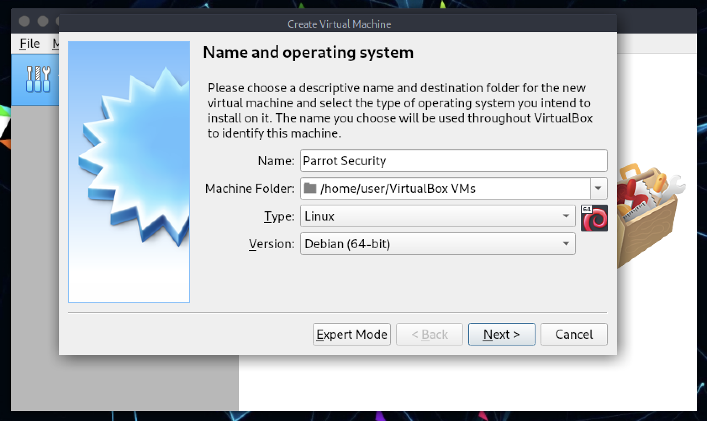

### Step 1.2 - Allocate Memory/RAM ###

The OS can run on machines with 512 MB of RAM, but at least **2 GB** is strongly recommended for both Parrot Security and Home Editions.
\

Choose the best setting for your machine and click *Next*.

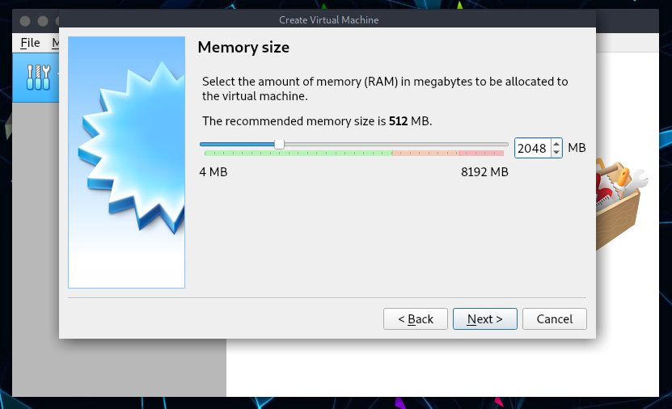

### Step 2 - Create a Virtual Hard Drive ###
On this screen select **Create a virtual hard disk now** (*2nd option*) and click *Create*.

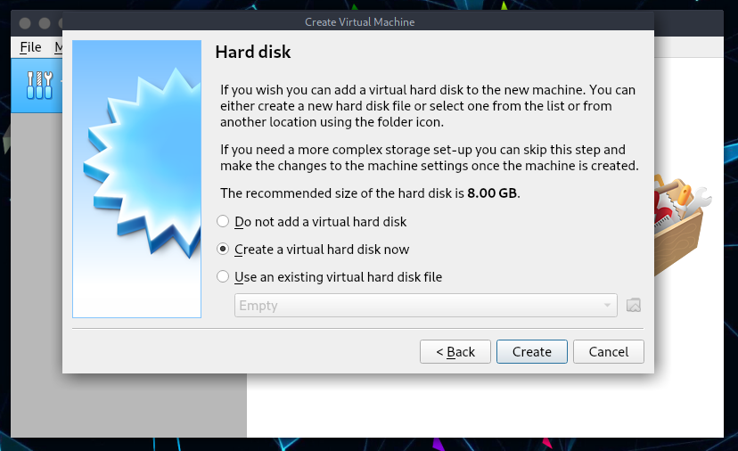

### Step 2.1 - Select Virtual Drive File type ###

On the next screen select **VDI** – **VirtualBox Disk Image** as your *Hard drive file type*.
\
Click *Next*.

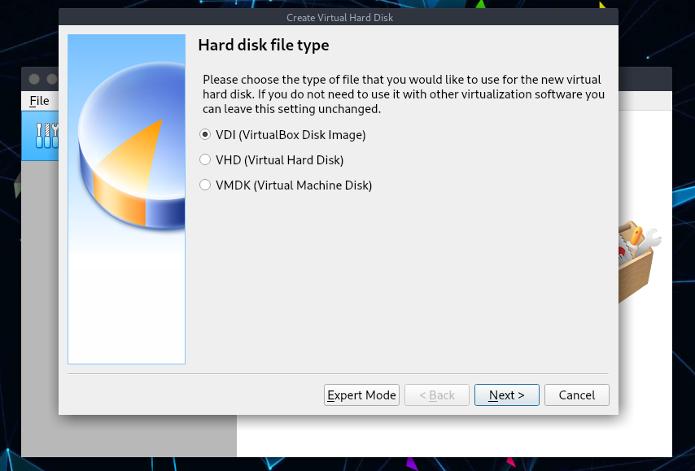

### Step 2.2 - Select Physical Hard Drive allocation type ###

Select **Dynamically Allocated** and click Next on *Storage on physical hard drive* window.

### Step 2.3 - Allocate disk size ###

On **File location and size** screen, it will show 8.00 GB as the default size (which we’ve set on Step 1.1). In this example we have increased it to 20 GB for storage reasons.
\

Choose which fits your needs and click *Next*. 

### Step 3 - Modify VirtualBox settings ###
So far, we’ve done the following, checklist for you:

  * Created a New Virtual Machine
  * Created Virtual Hard disk
  * Fiddled with disk properties, type and size.
 
At this point you should see the following screen:
  
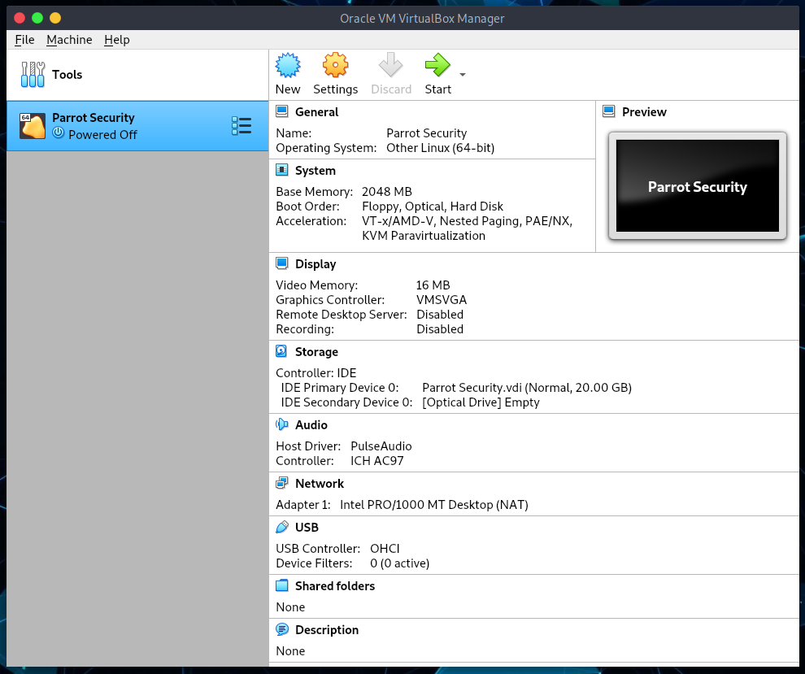
  
### Step 3.1 - Select type of OS ###

Depending on which ISO you downloaded, select the correct Version here.

As Parrot Security is derived from Debian, I’ve selected Other Linux (64-bit) on *General > Basic*.

### Step 3.2 - Enable shared Clipboard and Drag ’n’ Drop feature ###

Select *General > Advanced TAB* and change **Shared Clipboard** and **Drag ’n’ Drop** to Bidirectional. This will allow you to copy paste files from your HOST machine on the fly. Confirm by clicking *OK*.

### Step 3.3 - Update Virtual Motherboard options ###

Select *System > Motherboard*, un-check Floppy (who has a floppy anymore?) and check the box to [**Enable I/O APIC**](https://www.virtualbox.org/manual/ch03.html#settings-motherboard).
\

Note that you can change base memory allocation in the same screen. We’ve set it to 2048 MB previously. If your machine got 8.00 GB RAM, it means that you can allocate a lot more to make Parrot Security respond faster as a virtual machine.
\

If you feel your Virtualized Parrot Security is slow, you should increase this Base Memory allocation.

The calculations are as follows: 

  * 1.00 GB = 1024 MB
  * 2.00 GB = 2048 MB
  * 3.00 GB = 3072 MB
  * 4.00 GB = 4096 MB
    \
    and so on.

Multiply 1024 with the amount of Memory/RAM you want and put the value here.

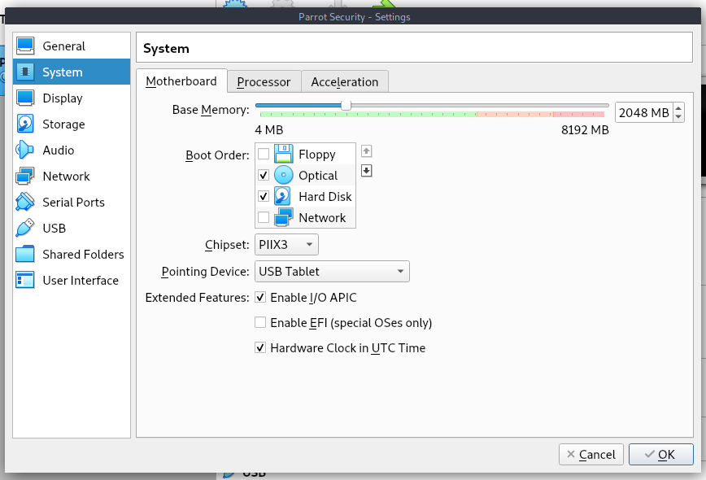

### Step 3.4 - Select number of Processors and enable PAE/NX ###

Sets the number of virtual CPU cores the guest OS can see. 
2 virtual cores works well. With 4, 6, and so on, performance will be much better. 

You should not configure virtual machines to use more CPU cores than are available physically. This includes real cores, with no hyperthreads. See [processor tab](https://www.virtualbox.org/manual/ch03.html#settings-processor) on VirtualBox website. 

Check the box for **Enable PAE/NX**.

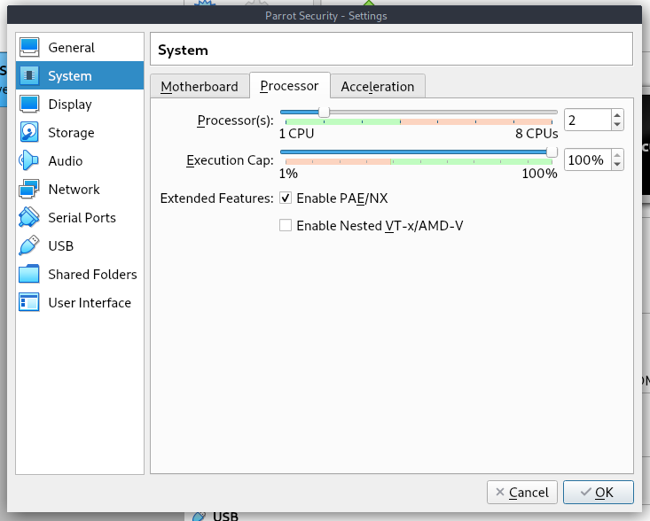

### Step 3.5 - Allocate Video memory and 3D acceleration ###

Select **Display > Screen > set Video Memory to 128 MB**. This allows for a good responsive desktop environment.

Also check the box for *Enable 3D Acceleration*.

If you have more than one monitor, you can change your settings here too.

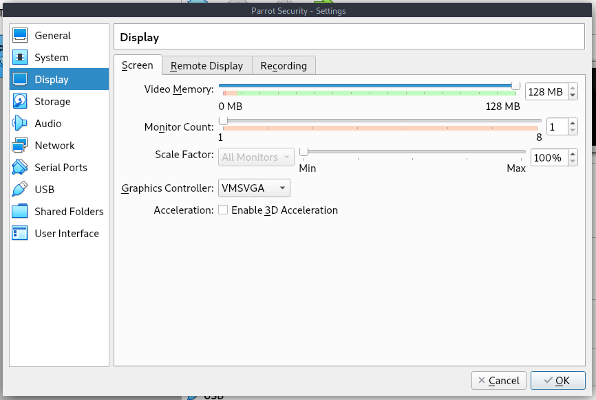

### Step 4 - Loading Parrot Security ISO ###

Select **Storage > Controller: IDE** and highlight Empty CD icon. Now on your right, you should be able to click on the little CD icon (it should be CD/DVD Drive: IDE Secondary Master already, if not change it) and select your downloaded ISO.
\

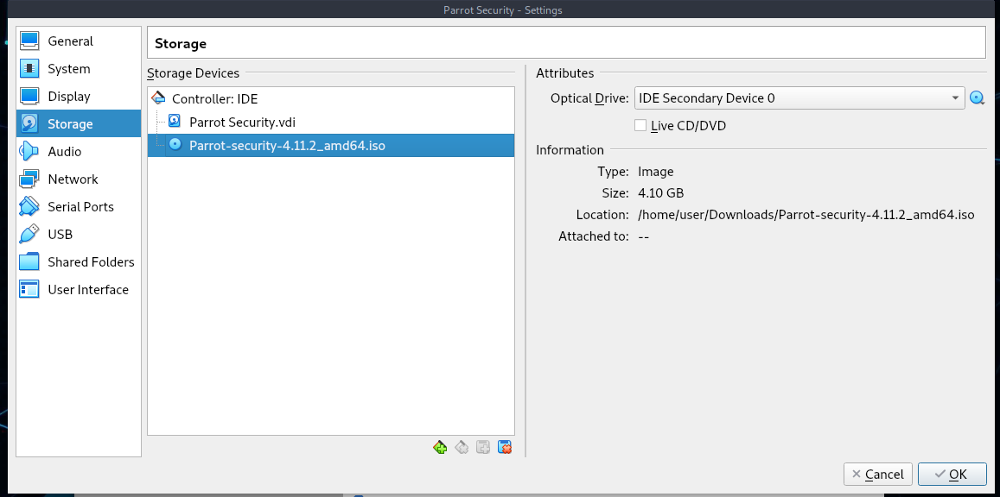

Once you select your downloaded ISO (in this case, it’s Parrot Security 4.11.2 ISO). See the properties and information’s changes accordingly.
\

**Important**: if your disk size is mismatched, you might have a corrupt disk. Refer to Parrot Security [chapter](../en/download-parrot.html) through this documentation for size related info. You can also do a SHA1 check to ensure your disk is not corrupted.

**Note**: if you want to test Parrot in live mode, check the *"Live CD/DVD"* box

### Step 4.1 - Select Network connection type ###

If your computer is connected to the internet, select NAT on *Network > Adapter 1*. You can enable more network adapters if you feel you want to do so. 

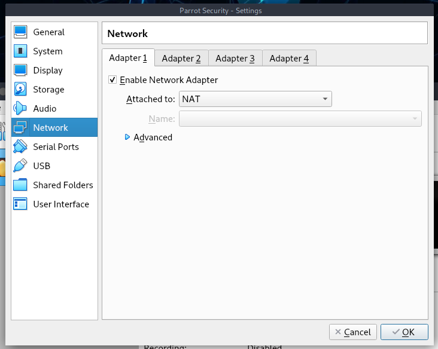

### Step 4.2 - Enable USB 2.0 and 3.0 Controllers ###

Firstly, make sure you have installed the *extension pack*, or you will not be able to enable USB 2.0 and 3.0 controllers.

If you have not installed it, you can download it [here](https://download.virtualbox.org/virtualbox/6.1.22/Oracle_VM_VirtualBox_Extension_Pack-6.1.22.vbox-extpack)

Then go to **files > preferences > extensions**, on the right there will be a `+` button where you can install the extension.

In GNU/Linux, you could also install it from the terminal with `sudo apt install virtualbox-ext-pack`

Once installed, it will enable VirtualBox Remote Desktop Protocol (VRDP) support and Host webcam passthrough support.

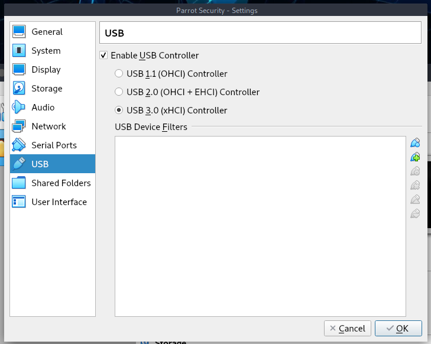

### Step 4.3 - It's all set up? ###

Finally, by clicking on your new virtual machine, this is what you should see:

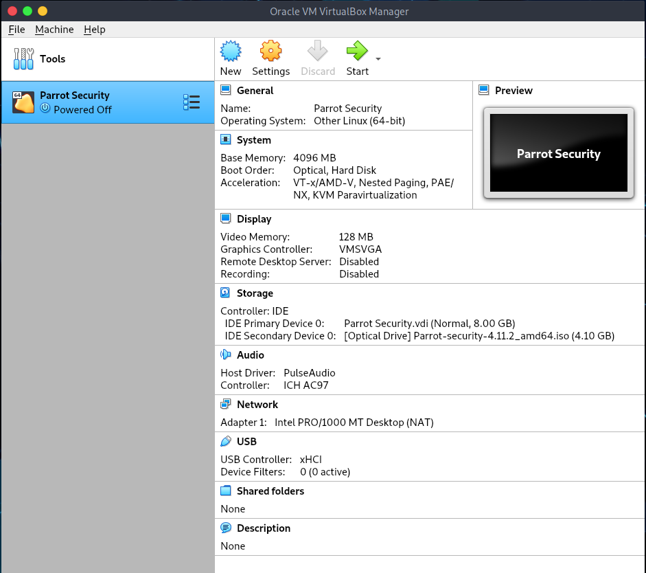

You can always change the configuration the way you prefer.

### Step 5 - Booting Parrot Security ISO ###

From VirtualBox Main Screen, click on Start and boot Parrot Security.

### Step 5.1 - choose Install ###

From VirtualBox Main Screen, it will boot Parrot Security, click in the Virtual Machine, select *Try/Install* and then click Enter.

### Step 5.2 - Choose the default Installer (Calamares) ###

Here you can test the OS in its entirety, then you can proceed with the installation.
\
Click on **Install Parrot**:

and the default installer, Calamares, will start.

### Step 5.3 - Select language ###

In this example we have chosen American English. Click on *Next*.

### Step 5.4 - Select location ###

Here we have selected America and New York zone. Click on *Next*.

### Step 5.5 - Select keyboard layout ###

Select the layout that best suits your keyboard, you can also test the keyboard's key where it says *type here to test your keyboard*. Click on *Next*.

### Step 5.6 - Parrot Security disk partitioning ###

As this is all Virtualized, you can choose anything you want to.
\

We think that guided partitioning for less experienced users is recommended, 40 GB or more are enough, unless you are going to install a lot more programs or keep more files on your hard drive.

Here you can decide whether to enable swap or not. For more information about swap, \
[https://wiki.debian.org/Swap](https://wiki.debian.org/Swap) \
[https://www.kernel.org/doc/html/latest/power/swsusp.html](https://www.kernel.org/doc/html/latest/power/swsusp.html)

*If you want*, you can also encrypt the system by adding a passphrase:

### Step 5.7 - Creating a new user account ### 

You will be asked to create a new user, for simplicity we have chosen a **user**.
You can enter any name in here. 

Then, click on *Next*

### Step 6 Completing the installation process ###

Finally, a summary of the choices made during the procedure:

You can decide whether to change the chosen settings, and then go back, or proceed with the installation of the system. Click on **Install**.

Confirm by clicking **Install now**

And wait for the installation to complete!
\
With an SSD (Sata), it takes a few minutes.

**Well done! You have successfully installed ParrotOS on your computer!**

### Step 7: Login to Parrot Security for the first time ###

Enter your Password:

**You just installed Parrot Security! Congrats!**

