# Install Nvidia GPU Driver #

Initially, Parrot uses the Nvidia **nouveau open source drivers**, since they support most Nvidia cards. These guarantee good stability and allow you to use your gpu without problems for everyday use. 

However, it may be necessary to use other drivers that give greater compatibility with different software and make the most of your GPU. For this reason, you can install **Nvidia's official (closed source) drivers**.

You have two ways to install, either via [the Parrot repo](./nvidia-drivers.html#install-the-driver-via-the-parrot-repository) or [from the official Nvidia website](./nvidia-drivers.html#install-the-driver-from-the-official-nvidia-website).

  

    <i class="fa fa-info-circle badge" aria-hidden="true"></i>

**Note 1**

  

  

  Please note the driver installation and configuration may be different for laptop or desktop computers. For example, the user could have a CPU with an iGPU (integrated GPU) and a dGPU (dedicated GPU). The user must choose which to use based on the context. 

  [The differences will be highlighted in this document](./nvidia-drivers.html#nvidia-driver-on-a-computer-with-igpu-and-dgpu).
  

  

    <i class="fa fa-info-circle badge" aria-hidden="true"></i>

**Note 2**

  

  

  Every step described here has been tested, so it is highly recommended that you read everything in this document very carefully.
  

## Install the driver via the Parrot repository ##

If you don't know your GPU model, open the terminal and type this command:

    lspci | grep VGA

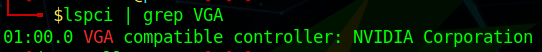

It will show your GPU model and its architecture. For further information use:

    inxi -F

This will show your computer information, including the GPU model and also the type of driver used.

Once you have ascertained that you are using the nouveau driver and you want to use the proprietary driver instead, for reasons of driver conflict, you must first disable the nouveau driver.

    sudo nano /etc/modprobe.d/blacklist-nouveau.conf

Add the following lines and save the file.
    
    blacklist nouveau
    options nouveau modeset=0
    alias nouveau off 

Once the file has been saved, proceed with the installation of the Nvidia driver using the following command:

    sudo apt update && sudo apt install nvidia-driver

This completes the installation, but we recommend that you check that everything went well. To do this, you can use the official utility from Nvidia called [nvidia-smi](https://developer.nvidia.com/nvidia-system-management-interface).

Install it by running:

    sudo apt install nvidia-smi

Start it with the following command:

    nvidia-smi

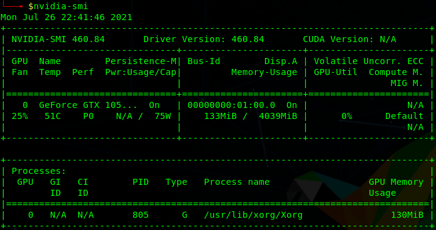

In addition, the settings manager will be automatically installed together with the drivers. From here you can change parameters such as the resolution and refresh rate of your monitor.

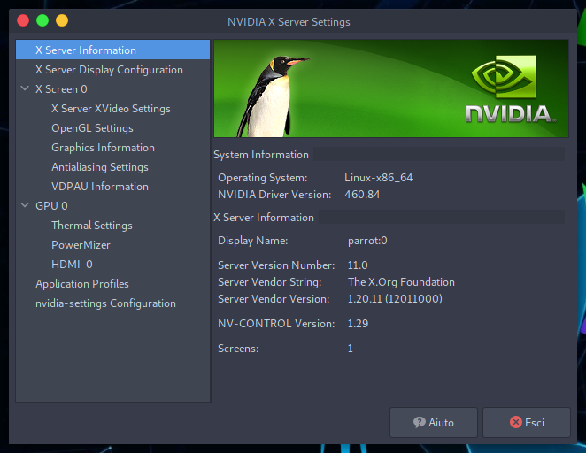

### Nvidia Driver on a computer with iGPU and dGPU ### 

Most modern computers come with an integrated video card in the CPU (iGPU, like an Intel Graphic Card or AMD in most cases) and a dedicated video card (dGPU, Nvidia).

In this guide we'll deal with the drivers for both video cards and show how to switch between them.

#### Step 1 - Install NVIDIA Drivers and CUDA Toolkit ####

Open the terminal and type:

    sudo apt update 

\

    sudo apt install bumblebee-nvidia primus-nvidia primus-vk-nvidia nvidia-smi nvidia-cuda-dev nvidia-cuda-toolkit

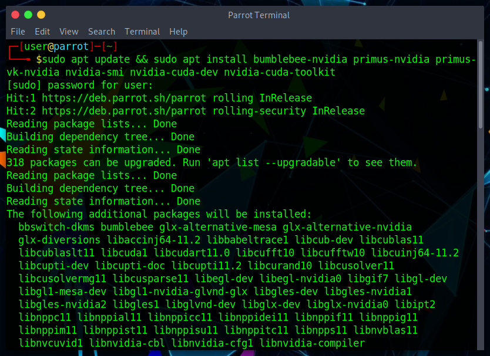

Wait for the installation to proceed. When a warning notifying **nouveau** driver conflicting with **nvidia** driver appears, click **ok**:

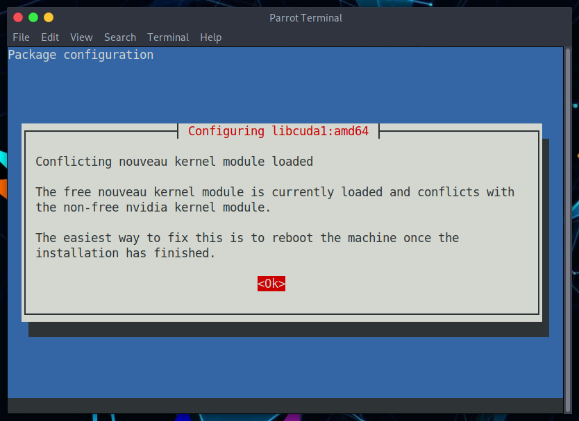

#### Step 2 - Blacklist Nouveau ####

  

    <i class="fa fa-info-circle badge" aria-hidden="true"></i>

**Note**

  

  

  if you have already followed <a href="./nvidia-drivers.html#install-the-driver-via-the-parrot-repository">the nvidia installation via the Parrot repo</a> you can go to <a href="./nvidia-drivers.html#step-3---configure-bumblebee">step 3</a>.
  

After the installation has finished, it's time to blacklist the **nouveau** driver in order to make the nvidia driver work.

In the terminal, type:

    sudo nano /etc/modprobe.d/blacklist-nouveau.conf

And add:

    blacklist nouveau
    options nouveau modeset=0
    alias nouveau off

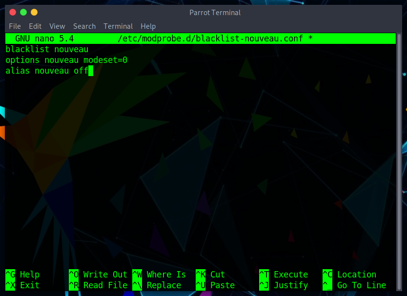

Save the file and reboot.
 
#### Step 3 - Configure Bumblebee ####

Now it's time to tell **bumblebee** which driver should be used.

In the terminal open `bumblebee.conf`:

    sudo nano /etc/bumblebee/bumblebee.conf

Look for the string `Driver=` and add `nvidia`, then look for the string `KernelDriver=` and add `nvidia-current`.

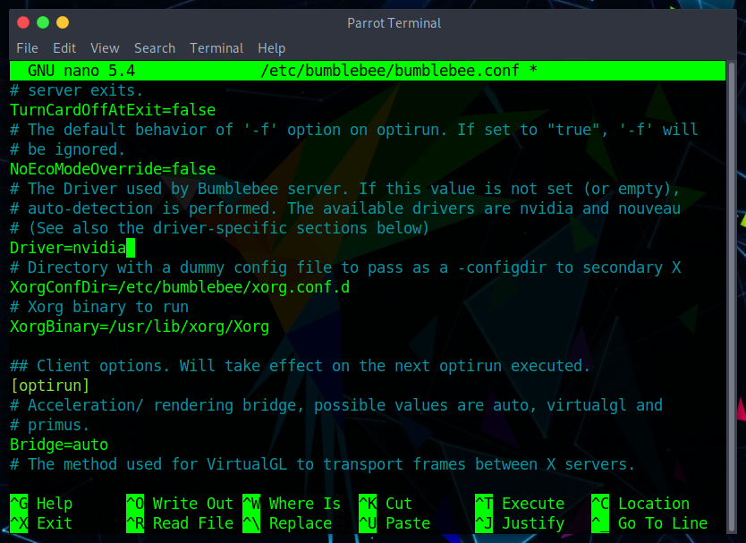

\

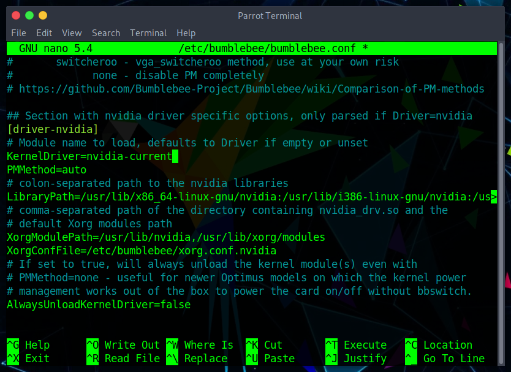

Save the file and reboot.

#### Step 4 - Testing the Drivers ####

Open a terminal and type:

    watch nvidia-smi

In a new terminal enter the following command:

    optirun hashcat -b -d 1

The result should be similar to this:

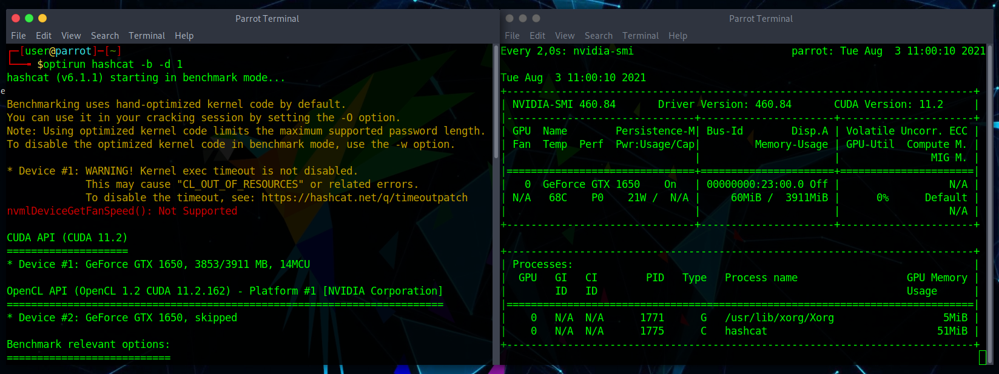

In `nvidia-smi` interface, `hashcat` should appear running using your Nvidia video card.

  

    <i class="fa fa-info-circle badge" aria-hidden="true"></i>

**Note**

  

  

  Launching application with <strong>primusrun</strong> will use PRIMUS Technology, while using <strong>optirun</strong> will use VirtualGL.
  

## Install the driver from the official Nvidia website ##

As mentioned at the beginning of this document, drivers can also be installed from Nvidia website.

You can download the latest driver directly from [here](https://www.nvidia.com/en-us/drivers/unix/), where there are also older drivers for old GPUs.

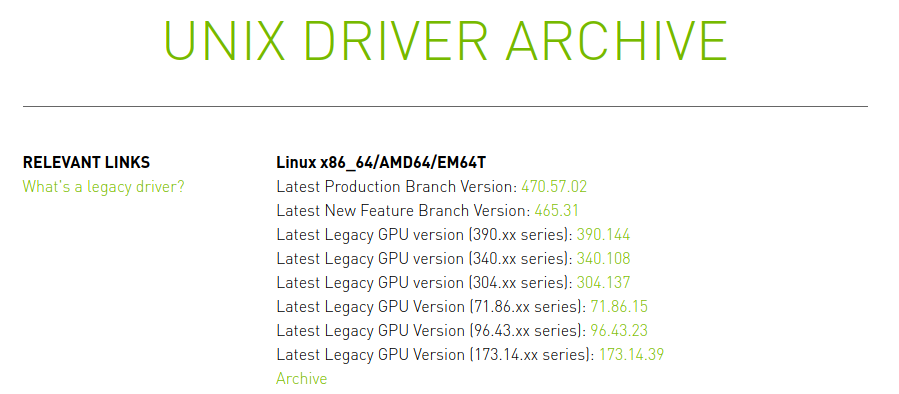

**OR**

Select the model of your GPU, the operating system (Linux 64 bit) and the branch [here](https://www.nvidia.com/Download/index.aspx?lang=en-us).

From the Nvidia website: 

"*Production Branch*: Production Branch drivers provide ISV certification and optimal stability and performance for Unix customers. This driver is most commonly deployed at enterprises, providing support for the sustained bug fix and security updates commonly required.

*New Feature Branch*: New Feature Branch drivers provide early adopters and bleeding edge developers access to the latest driver features before they are integrated into the Production Branches."

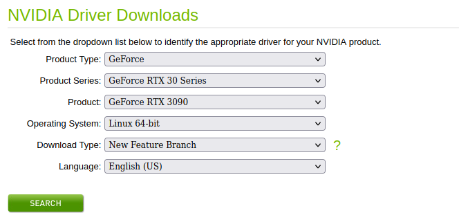

Click on **download**, and a file with this name will be downloaded: \
`NVIDIA-Linux-x86_64-<driver version>.run` (about 260 mb)

To avoid conflicts with the X graphics server, we will have to use Parrot without a graphical interface (we will have to drop to [Runlevel 3](https://en.wikipedia.org/wiki/Runlevel)). 

We can do this simply via systemd, with the systemctl command:

    sudo systemctl set-default multi-user.target

  

    <i class="fa fa-info-circle badge" aria-hidden="true"></i>

**Note**

  

  

  If by any chance you want to go back and reuse Parrot with MATE, use the following commands:
        
    sudo systemctl set-default graphical.target 

\

    reboot

  

To avoid conflicts with the installation of the new driver, remember to blacklist the nouveau driver:

    sudo nano /etc/modprobe.d/blacklist-nouveau.conf

Add these lines then save the file:

    nouveau blacklist
    options nouveau modeset=0
    alias nouveau off

Run the following command to regenerate the initramfs image.

    sudo update-initramfs -u

The last step is to disable nouveau drivers by rebooting the machine:

    reboot

Now navigate to the folder where you downloaded the **.run** file and give it execute permissions:

    sudo chmod +x NVIDIA-Linux-x86_64-<driver version>.run

  

    <i class="fa fa-info-circle badge" aria-hidden="true"></i>

**Note**

  

  

  If you don't remember what chmod does, it is recommended that you read the [File and Directory permissions](./file-and-directory-permissions.html) document.
  

After that you can start the **.run** file:

    sudo ./NVIDIA-Linux-x86_64-<driver version>.run

The installation wizard process will start and the drivers will be installed along with all utilities (including Nvidia Driver X Settings).

Return to MATE via the command:

    sudo systemctl set-default graphical.target 

You will go from Runlevel 3 to Runlevel 5, and finally you will be able to use the nvidia driver. 

To verify that everything went well, start nvidia-smi (already installed through *.run* file):

    nvidia-smi

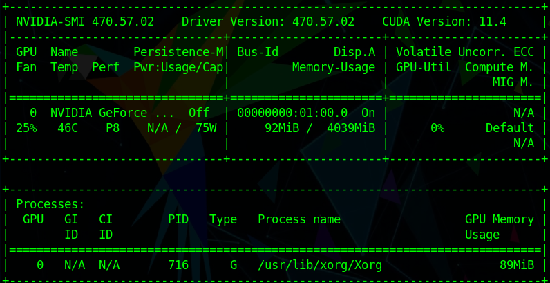

Notice that in this case the latest Nvidia (470.57.02) driver was installed.
