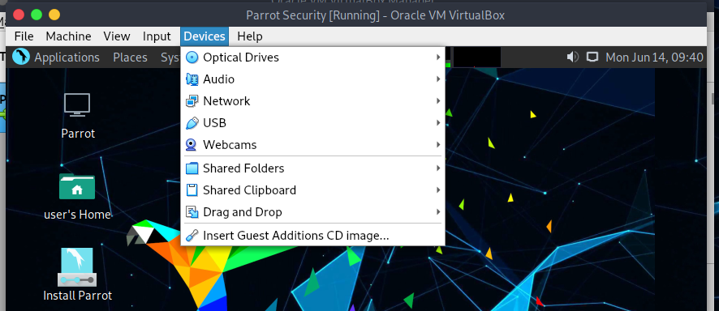
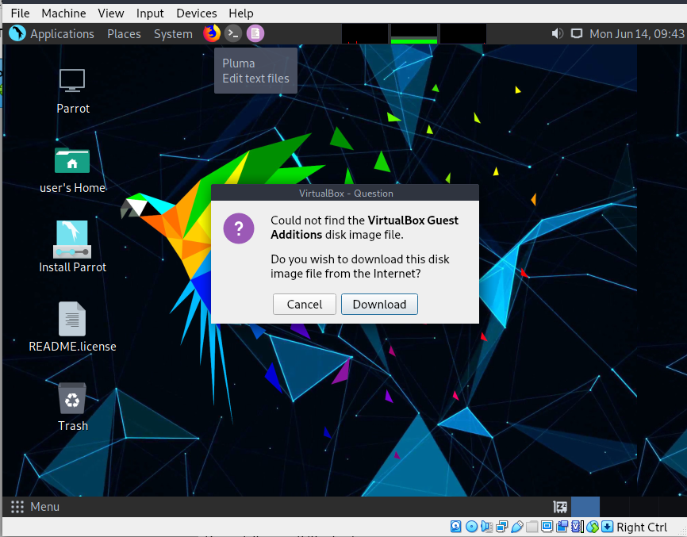
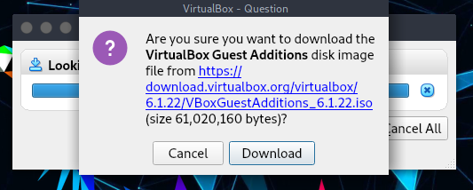
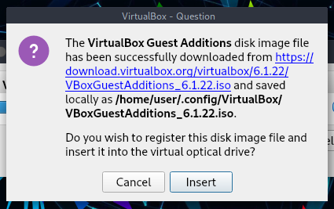
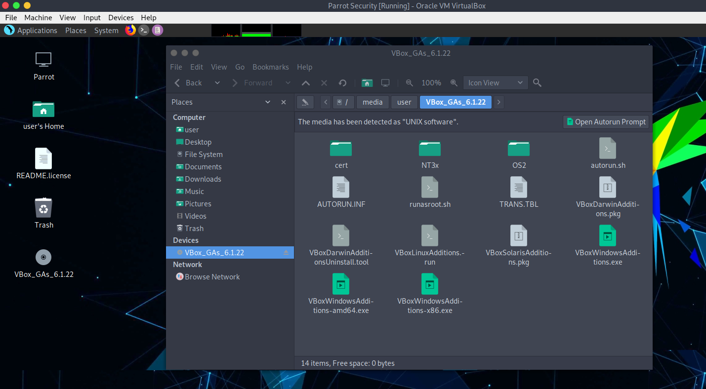
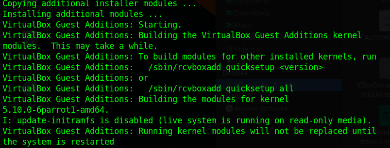

# Introduction to Virtualbox Guest Additions #
The Guest Additions are designed to be installed inside a virtual machine after the guest operating system has been installed. They consist of device drivers and system applications that optimize the guest operating system for better performance and usability.

## Features of Virtualbox Guest Additions ##

  * **Mouse pointer integration**
    * Pressing the Host key is no longer required to "free" the mouse from being captured by the guest OS.

  * **Shared folders**
    * Shared folders between Host and Parrot.

  * **Better video support**
    * While the virtual graphics card which VirtualBox emulates for any guest operating system provides all the basic features, the custom video drivers that are installed with the Guest Additions provide you with extra high and non-standard video modes as well as accelerated video performance. 
    \
    **(Generally used for changing monitor resolution)**

  * **Seamless windows**
    * With this feature, the individual windows that are displayed on the desktop of the virtual machine can be mapped on the host's desktop, as if the underlying application was actually running on the host.

  * **Generic host/guest communication channels**
    * The Guest Additions enable you to control and monitor guest execution in ways other than those mentioned above. The so-called "guest properties" provide a generic string-based mechanism to exchange data bits between a guest and a host, some of which have special meanings for controlling and monitoring the guest.

  * **Time synchronization**
    * Synchronize date and time from host to Parrot.

  * **Shared clipboard**
    * Shared clipboard from host to Parrot.

For more infomations, check the [VirtualBox manual](https://www.virtualbox.org/manual/ch04.html).

\
\
# Guest Additions Installation(s) #

## Method 1 (Easiest) ##

**1.** Open a terminal and update your packages list from the repository with
 
    sudo apt update

\

**2.** Install the Guest Additions from Parrot OS repository with 

    sudo apt install virtualbox-guest-utils

\

**3.** And install the last package with 
    
    sudo apt install virtualbox-guest-x11

\

**4.** When the installation is completed, you can reboot your machine with 

    sudo reboot

\

**5.** Check if Guest Additions are correctly installed by running 

    sudo /usr/sbin/VBoxService -V 

## Method 2 (From ISO) ##

**1.** On Virtual Machine menu bar, select `Devices > Insert Guest Additions CD image...`.

 

\

**2.** VirtualBox will not find the Guest Additions and for this it will ask you to download them, click on *Download*. We recommend adding an additional secondary optical drive, because once the guest additions are downloaded, they will be mounted on a second drive.

 

\

 

\

 

\

Click on "**insert**". If it returns an error (maybe it can't mount the iso you just downloaded, then turn off the virtual machine, and return to the main VirtualBox screen, go to *Setting > Storage*, here add another optical drive (make sure it is secondary so as not to give problems in booting the distro). 

 

**3.** Then go to the Guest Addition ISO folder, and here open a terminal and give 

    sudo chmod +x VBoxLinuxAdditions.run

Once done it, execute

    sudo ./VBoxLinuxAdditions.run

**4.** Wait for the installation process. At installation completed, reboot the virtual machine with 

 

    sudo reboot